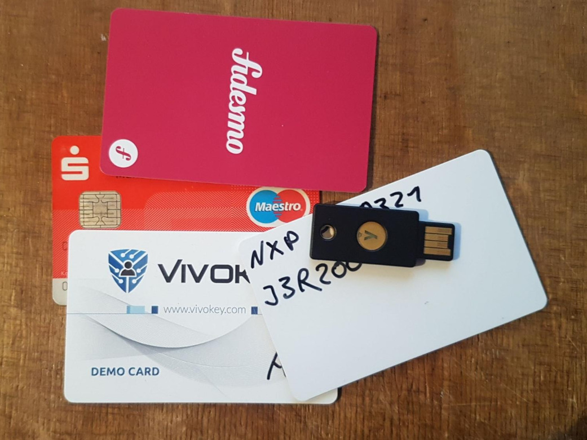

# Introduction to the JavaCard Ecosystem

**JavaCards** are a subset of the devices known as **Smartcards**, i.e. small plastic cards or tokens which contains a microprocessor and a communication interface.

Even if you don't know it, chances are good you used a JavaCard today. Most SIM cards run on JavaCard, the chips inside modern credit cards and debit cards do as well, and there are even chips embedded in some passports which run JavaCard. Ever wondered where that ominous "3 billion devices run Java" tagline comes from? Well, now you know :^).

Compared to other microprocessors, JavaCards are actually pretty complex. They usually come with an operating system, a set of software libraries and even a security and permissions control system. However, most chips are rather limited in terms of storage and memory - think kilobytes instead of gigabytes.

Some chips come with a wireless NFC interface, some come with gold contacts (like on a SIM card), and some have both.

## JavaCard (JC)

**"JavaCard"** is a set of standards and specifications to run software on embedded systems. If you are used to the Java ecosystem, many things will be familiar: the software is packaged into applets, which are then run in a Virtual Machine. This allows for portability of an applet across many cards.

The programming language used is a true subset of Java, however the available APIs are different, and special care has to be taken when managing memory. For example, special atomic data transfer functions are available to ensure data integrity.

JavaCard and the development SDKs are nowadays managed by Oracle Inc.

## GlobalPlatform (GP)

The **GlobalPlatform** specifications are another set of industry standards, which primarily define interactions with the JavaCard - specifically the management and installation of applets.

### Keys and Authentication

GP enforces authentication and code signatures (DAP Verification) during the applet installation. The card applet storage can only be modified if the correct card administration key is provided, or if the applets are properly signed. The FlexSecure ships with the default GP development administration key `404142434445464748494a4b4c4d4e4f`. You can change this key if you want to - but do not forget it, there is no way to recover the card once it is locked.

This key is additionally used to open a secure communication channel to the card, via which the applet data is transferred.

Although unusual, it is possible to internally communicate between applets on a card. It is also possible to segment the card memory and storage into multiple independent security domains, and then use e.g. a "high-security" one for payment applets. These partitions can use different keys, and/or use derived keys from a master key or certificate. This is how Fidesmo runs payment functionality next to signed third-party applets on the same card, while ensuring the integrity of the payment applet.

The whole signature and key derivation process is complex, and out of scope for this introduction.

Many vendors implement their own proprietary extensions on top of GP, e.g. for EMV payment applets or legacy emulation.

### GlobalPlatformPro (GPP)

A good and open-source GP interfacing software is GlobalPlatformPro (GPP). Download the latest stable version of GPP from https://github.com/martinpaljak/GlobalPlatformPro/releases . On Windows, you have the option to use the exe file, the jar file works on all operating systems.

If you use the jar version, download and install the latest version of the Java runtime from your package manager or e.g. the Oracle website.

The best user guide for GPP can be found in its repository readme file.

## Java Card OpenPlatform (JCOP)

JCOP is an embedded operating system for secure elements, which implements the JavaCard and GlobalPlatform specifications. It is mainly developed by NXP, and used on their chips.

On some chips, JCOP might provide additional proprietary functionality. The version running on the FlexSecure is JCOP4, which implements GP 2.2.1 and 2.3, and is compatible to the JC API 3.0.4 Classic and 3.0.5 Classic.

## ISO 7816 and Personal Computer / Smart Card (PC/SC)

The ISO/IEC 7816 standard defines smart cards in general. Among things like physical characteristics or electrical connections, the most relevant section is part 4, which defines the data exchange protocol using **APDUs** (Application Defined Data Units).

The PC/SC industry standard defines a set of mechanisms and APIs for the usage of smart cards on host operating systems, like Linux and Windows. An open-source implementation for Linux is provided by pcsc-lite, Windows and OSX ship their own implementations. All these APIs implement the WinSCard interface.

### Answer To Reset (ATR)

When a smartcard is reset / connected, it responds with a characteristic message, the ATR. This message contains information about data coding conventions, supported communication speeds, and much more. It can be used to identify cards of the same type and/or manufacturer. For example, pcsc-lite ships with a list of known ATRs, and displays a human-readable name for the one it recognizes.

### Application Protocol Data Units (APDUs)

The communication with a smartcard is performed by sending command data buffers to the card, and receiving response buffers. These APDU buffers have to follow the ISO 7816 standard.

Each APDU response contains a response code, The most important one is `0x90 0x00`, which signals a successful command.

## Packages and Applets

JC applications are distributed in `.cap` (converted applet) files. These files contain (usually) one **package**. A package can be loaded onto a card using GP, where it will be placed into the embedded filesystem.

### Application Identifiers (AIDs)

An application identifier (AID) is a hexadecimal string of numbers, which globally uniquely identifies an applet. Companies have to apply to get their AIDs registered, and in theory no one else should use these AIDs for anything else. This of it like a domain name in the internet, a list of known AIDs is linked below.

### Applet Instances

After a package has been deployed, the next step is to create an applet **instance** from it. A package can contain multiple applets, and an applet can be instantiated more than once if needed. The package ID, applet ID and AID can be dynamically specified at the time of instantiation, or be read from preset values in the package metadata.

Usually, loading the package and instantiating the applet is done in one step. Some applets may require some additional installation configuration parameters, which can be passed as well.

Before any communication with an applet can happen, it has to be selected by using its AID. An applet can be marked as **default**, in which case it is always automatically selected after a card reset.

Instances are retained across card resets and power cycles, and so is their non-volatile data (e.g. private keys).

## Sources and Further Reading

- https://en.wikipedia.org/wiki/Java_Card
- https://en.wikipedia.org/wiki/Java_Card_OpenPlatform
- https://www.oracle.com/java/technologies/java-card-tech.html
- https://www.oracle.com/java/technologies/java-card/javacard1.html
- https://globalplatform.org/
- https://github.com/martinpaljak/GlobalPlatformPro
- https://javacardos.com/javacardforum/
- https://en.wikipedia.org/wiki/ISO/IEC_7816
- http://cardwerk.com/iso-7816-part-4
- https://en.wikipedia.org/wiki/Smart_card_application_protocol_data_unit
- https://en.wikipedia.org/wiki/PC/SC
- https://docs.microsoft.com/en-us/windows/win32/api/winscard/
- https://pcsclite.apdu.fr/
- https://en.wikipedia.org/wiki/Smart_card_application_protocol_data_unit
- https://www.javacardos.com/tools/apdu-parser
- https://www.eftlab.com/knowledge-base/complete-list-of-apdu-responses/
- https://www.eftlab.com/knowledge-base/171-atr-list-full/
- https://smartcard-atr.apdu.fr/
- https://www.eftlab.com/knowledge-base/211-emv-aid-rid-pix/

Improve this document: https://github.com/StarGate01/flexsecure-applets/tree/master/docs